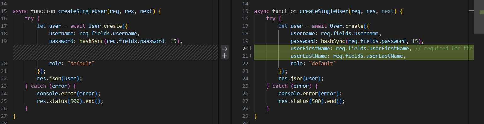

# Mohamed's believe-fitness-svendeproeve
## Mohamed Osman Wu-13


  ## Valgfri opgave

Jeg har løst **opgave B** og **delvist opgave C**
### Opgave B – Opret bruger

Nye brugere kan oprette en konto via en signup formular.

Brugeren indtaster:
- fulde navn
- brugernavn
- password
- gentag password 

Alt input bliver valideret med Zod, og der tjekkes også at de to passwords matcher med .refine().

navn splittes med split(" ", 2) til userFirstName og userLastName`, før data sendes til API'et.

Under udviklingen fandt jeg ud af at der var en bug i backend.  
User.create() i controlleren modtog ikke userFirstName og userLastName, selvom frontend sendte dem korrekt, det gjorde at nye brugere fik null som navn.   

Jeg fandt fejlen ved at logge API responsen og sammenligne med det data der blev sendt, og rettede det i controlleren.



### Opgave C – Opret class (delvist)

En admin-bruger kan oprette nye klasse via en formular.  
Formularen validerer felter med Zod, lader admin vælge en træner i en dropdown og uploader et billede til API'et via POST /api/v1/assets for at få et assetId.

Dette assetId sendes derefter med i POST /api/v1/classes.

**Rediger og slet er ikke implementeret.**


## Tech stack

- **Next.js**  
    
  Next.js er det framework jeg har bygget hele applikationen i.  
Det er et **React-framework**, så React er allerede inkluderet.

Next.js bruger **fil-baseret routing**. Hvis man vil lave en ny side, laver man bare en mappe med en page.jsx fil  ingen ekstra konfiguration.

Next.js skelner mellem **server components** og **client components**.

- **Server components** kører på serveren og sender færdig HTML til browseren, hvilket gør siden hurtigere.
- **Client components** bruges kun til interaktivitet formular eller animation osv.

Som udgangspunkt bruges server components. `"use client"` tilføjes kun når det er nødvendigt.

- **Believe Fitness API**  
Appen bruger et REST-API på `http://localhost:4000/api/v1` 

- Auth/token
- V1/
- Testimonials
- News
- Newsletter Signup
- Messages
- Assets
- Classes
- Trainers
- Users

- **Tailwind CSS**  
    
  Tailwind bruges til styling direkte på elementer som klasser. Brandfarven #F1C40E er defineret som --color-Uranium i `globals.css` og bruges som bg-Uranium eller text-Uranium. Custom utility-klasser som `.flex-center` håndterer gentagende mønstre.
 Jeg kombinerer Tailwind med custom CSS i globals.css til komplekse løsninger patterns for at holde min appen ren.

### Icons

- **react-icons**  
  Et bibliotek med tusindvis af SVG-ikoner der bare kan importeres og styles med Tailwind. Brugt til bl.a. hamburger menuen og navigationsikoner. Alternativet ville være separate SVG-filer for hvert ikon  det bliver hurtigt rodet.

### Form Validering

- **Zod**  
    
  Valideringsbibliotek til at sikre korrekt datahåndtering i forms definerer schemas og validerer inputtet før API-kald.

### Toast

- **[react-hot-toast- click to go their site](https://react-hot-toast.com/)**  
  
  Toastnotifikationer til succesbeskeder ved form-submit og fejlvisning direkte under relevante formularfelter.
  men jeg hard brugt ku til succes indtilvidere

### Animation

- **[Framer Motion](https://www.framer.com/motion/)**  
  Animationsbibliotek til side-transitioner i `template.jsx`—giver siden et app-agtigt feel med fade-in og bevægelseseffekter.

---

## Kodeeksempel – Server action til signup med Zod validering

[Gå til koden i projektet](../src/Components/signupform/action.js)

```javascript
"use server";

import { z } from "zod";
import { redirect } from "next/navigation";

const signupSchema = z.object({
    fullName: z.string().min(2, "Indtast mindst 2 tegn."),
    username: z.string().min(3, "Brugernavn skal være mindst 3 tegn.").regex(
        /^[a-zA-Z0-9._-]+$/,
        "Brug kun bogstaver, tal, punktum, _ eller -.",
    ),
    password: z.string().min(4, "Adgangskode skal være mindst 4 tegn."),
    confirmPassword: z.string().min(1, "Gentag adgangskoden."),
}).refine((data) => data.password === data.confirmPassword, {
    message: "Adgangskoderne matcher ikke.",
    path: ["confirmPassword"],
});

export async function signupUser(_, formData) {
    const values = {
        fullName: formData.get("fullName"),
        username: formData.get("username"),
        password: formData.get("password"),
        confirmPassword: formData.get("confirmPassword"),
    };

    const result = signupSchema.safeParse(values);

    if (!result.success) {
        const fieldErrors = z.flattenError(result.error).fieldErrors;
        return { values, errors: fieldErrors };
    }

    const [userFirstName, userLastName = ""] = values.fullName.trim().split(" ", 2);

    const response = await fetch("http://localhost:4000/api/v1/users", {
        method: "POST",
        headers: { "Content-Type": "application/json" },
        body: JSON.stringify({
            userFirstName,
            userLastName,
            username: values.username,
            password: values.password,
        }),
    });

    if (!response.ok) {
        return {
            values,
            errors: { form: ["Kunne ikke oprette bruger. Prøv igen."] },
        };
    }

    redirect("/Login");
}
```

Hvad gør koden?
Denne funktion styrer hele vejen fra, at brugeren trykker "opret", til de er oprettet i systemet. Den læser input, tjekker for fejl med Zod, deler navnet op og sender det til databasen.

Trin for trin:

"use server": Dette betyder, at koden kun kører i sikkerhed på serveren. Det er vigtigt, så ingen kan opsnappe koder eller hemmeligheder direkte i browseren.

Henter data: Henter alt det, brugeren har skrevet i felterne (navn, brugernavn, password), og gemmer det i en samlet pakke, vi kalder values.

Tjekker for fejl: Med safeParse() spørger vi Zod: "Ser det her rigtigt ud?". Hvis brugeren f.eks. har glemt at udfylde et felt, får vi besked med det samme uden at siden går ned.

Sender fejl retur: Hvis noget er galt, bruger vi z.flattenError() til at lave en nem liste med fejl (f.eks. "Adgangskoden er for kort"). Vi sender også det, de allerede har skrevet, tilbage, så de ikke skal starte forfra.

Deler navnet op: Da API'et vil have fornavn og efternavn hver for sig, bruger vi split(" ", 2). Det tager et fuldt navn og deler det i to ved det første mellemrum.

Opretter brugeren: Til sidst sender vi det hele til API'et. Hvis alt spiller, bliver brugeren sendt direkte videre til login-siden med en redirect.

---

## Perspektivering

### Framework & Performance
Jeg har valgt Next.js, fordi det gør siden hurtig.

### Server-side logik
I stedet for at rode med en masse forskellige filer til at sende data, bruger jeg Server Actions, som samler det hele et sted og gør koden meget mere overskuelig.

### Datahåndtering & sikkerhed
For at være sikker på, at brugeren skriver de rigtige ting i formularerne, bruger jeg Zod til at tjekke alt igennem, før det bliver sendt videre til databasen. Jeg har samlet alt mit "hente_data_kode" i en bestemt mappe, så jeg ikke skal lede hele projektet igennem, hvis noget skal ændres senere. Når brugeren logger ind, gemmer jeg deres login-bevis i en cookie i stedet for i browserens hukommelse, da det er langt sikrere mod hackere.

### Styling & animation
Til selve udseendet bruger jeg Tailwind for utility-first styling, og Framer Motion i [template.jsx](../src/app/template.js) til side-transitioner—det giver appen et moderne, app-agtigt feel.
- **JWT gemt i cookie**  
  JWT-token i cookie kan læses på serveren til konditionel rendering (fx `layout.jsx`)—sikrere og hurtigere end localStorage.

### Samlet approach
Det hele er bygget op, så det er nemt at rette fejl, og brugeren altid får en god og sikker oplevelse uden ventetid.